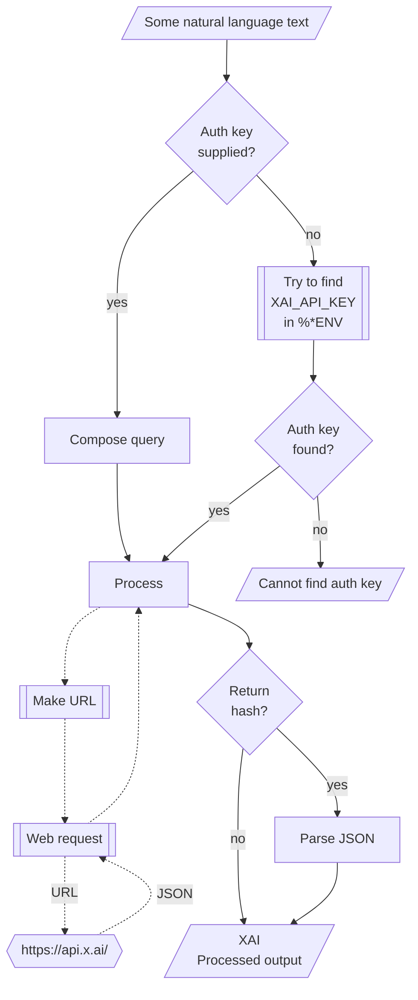

# WWW::XAI

## In brief

This Raku package provides API access to the Large Language Models (LLMs) service [(Space)XAI](https://console.x.ai/), [XAI1].
For more details of the XAI's API usage see [the documentation](https://docs.x.ai/overview), [XAI2].

**Remark:** To use XAI'1 API one has to register and obtain authorization key.

This package is very similar to the packages 
["WWW::OpenAI"](https://github.com/antononcube/Raku-WWW-OpenAI), [AAp1], and 
["WWW::Gemini"](https://github.com/antononcube/Raku-WWW-Gemini), [AAp2]. 

"WWW::XAI" can be used with (is integrated with) 
["LLM::Functions"](https://github.com/antononcube/Raku-LLM-Functions), [AAp3], and
["Jupyter::Chatbook"](https://github.com/antononcube/Raku-Jupyter-Chatbook), [AAp5].

Also, of course, prompts from 
["LLM::Prompts"](https://github.com/antononcube/Raku-LLM-Prompts), [AAp4],
can be used with XAI's functions.

-----

## Installation

Package installations from both sources use [zef installer](https://github.com/ugexe/zef)
(which should be bundled with the "standard" Rakudo installation file.)

To install the package from [Zef ecosystem](https://raku.land/) use the shell command:

```
zef install WWW::XAI
```

To install the package from the GitHub repository use the shell command:

```
zef install https://github.com/antononcube/Raku-WWW-XAI.git
```

----

## Universal "front-end"

The package has an universal "front-end" function `xai-console` for the 
[different functionalities provided by XAI](https://docs.x.ai/overview).

Here is a simple call for a "chat completion":

```raku
use WWW::XAI;
my $ans = xai-console('Where is Roger Rabbit?');
to-json(from-json($ans), :pretty)
```
```
# {
#   "reasoning": {
#     "summary": "detailed",
#     "effort": "low"
#   },
#   "max_output_tokens": null,
#   "id": "21b74844-4cab-9e14-b54e-da2443c4b0c2",
#   "parallel_tool_calls": true,
#   "temperature": 0.7,
#   "top_logprobs": 0,
#   "output": [
#     {
# ...
#       "status": "completed",
#       "type": "reasoning"
#     },
#     {
#       "content": [
#         {
# ...
#           "type": "output_text",
#           "text": "**In Toontown.**\n\n(Last seen there with Jessica, probably dodging anvils and yelling \"P-p-p-please!\")"
#         }
#       ],
#       "role": "assistant",
#       "status": "completed",
#       "id": "msg_21b74844-4cab-9e14-b54e-da2443c4b0c2",
#       "type": "message"
#     }
#   ],
#   "frequency_penalty": 0.0,
#   "status": "completed",
#   "service_tier": "default",
#   "tools": [
#   ],
#   "store": true,
# ...
#   "text": {
#     "format": {
#       "type": "text"
#     }
#   }
# }
```

**Remark:** By default `xai-console` returns just a compact JSON string of XAI's response. That is why above, in order to get a pretty JSON display, is used line `to-json(from-json($ans), :pretty)`.

Another one using Bulgarian:

```raku
xai-console('Колко групи могат да се намерят в този облак от точки.', max-tokens => 1024, format => 'values');
```
```
# Не виждам никакъв облак от точки (изображение или данни) в съобщението. Моля, качи го или опиши точките, за да мога да отговоря.
```

**Remark:** When the authorization key, `auth-key`, is specified to be `Whatever`
then the functions `xai-*` attempt to use the env variable `XAI_API_KEY`.

----

## Models

The current XlAI models can be found with the function `xai-models`:

```raku
.say for |xai-models;
```
```
# grok-4.20-0309-non-reasoning
# grok-4.20-0309-reasoning
# grok-4.20-multi-agent-0309
# grok-4.3
# grok-4.5
# grok-build-0.1
# grok-imagine-image
# grok-imagine-image-quality
# grok-imagine-video
# grok-imagine-video-1.5
```

----

## Code generation

XAI'API provides a special endpoint for code generation which is used if `xai-console`'s argument "path" is set to "code". Here is a Raku code generation example:

```raku, results=asis, output-prompt=>
xai-console(
        'generate Raku code for making a loop over a list',
        path => 'code',
        max-tokens => 1024,
        format => 'values');
```
>Here's how to loop over a list in **Raku**:
>
>### 1. Basic `for` loop (most common)
>
>```raku
>my @fruits = <apple banana cherry>;
>
>for @fruits -> $fruit {
>    say $fruit;
>}
>```
>
>### 2. Using the topic variable `$_`
>
>```raku
>for @fruits {
>    say $_;
>}
>```
>
>### 3. With index (using `.kv`)
>
>```raku
>for @fruits.kv -> $index, $fruit {
>    say "$index: $fruit";
>}
>```
>
>### 4. Postfix `for` (concise)
>
>```raku
>say $_ for @fruits;
>```
>
>### 5. Using `map` (when you want to transform)
>
>```raku
>@fruits.map({ say $_ });
>```
>
>### Bonus: C-style loop (less common)
>
>```raku
>loop (my $i = 0; $i < @fruits.elems; $i++) {
>    say @fruits[$i];
>}
>```
>
>**Recommendation**: Use the `for` loop (example #1 or #2) — it's the most idiomatic in Raku.


----

## Images

Images can be generated with the sub `xai-console` with the argument "path" being set to "image". 
For example, here an image is generated and a URL to is returned: 

```raku, eval=FALSE
my $res = xai-console('Generate an image of a raccoon chasing a butterfly.', path => 'image', format => 'values');
```

Here is an example in which a Base64 string is returned and then rendered as an image:

```raku, eval=FALSE
use Image::Markup::Utilities;
my $img = xai-console(
    'Sketches of butterfly themed playing cards (for bridge, etc.)', 
    path => 'image', 
    response-format => 'b64_json',
    format => 'values');
image-from-base64($img);
```

----

## Chat completions with engineered prompts

Here is a prompt for "emojification" (see the
[Wolfram Prompt Repository](https://resources.wolframcloud.com/PromptRepository/)
entry
["Emojify"](https://resources.wolframcloud.com/PromptRepository/resources/Emojify/)):

```raku
my $preEmojify = q:to/END/;
Rewrite the following text and convert some of it into emojis.
The emojis are all related to whatever is in the text.
Keep a lot of the text, but convert key words into emojis.
Do not modify the text except to add emoji.
Respond only with the modified text, do not include any summary or explanation.
Do not respond with only emoji, most of the text should remain as normal words.
END
```


Here is an example of a chat completion with emojification:

```raku
xai-console([ system => $preEmojify, user => 'Python sucks, Raku rocks, and Perl is annoying'], max-tokens => 1024, format => 'values')
```
```
# 🐍 sucks, Raku 🪨, and 🐪 is 😠
```

-------

## Command Line Interface

The package provides a Command Line Interface (CLI) script:

```shell
xai-console --help
```
```
# Usage:
#   xai-console <text> [--path=<Str>] [--mt|--max-tokens[=UInt]] [-m|--model=<Str>] [-r|--role=<Str>] [-t|--temperature[=Real]] [--response-format=<Str>] [--video-id=<Str>] [-a|--auth-key=<Str>] [--timeout[=UInt]] [-f|--format=<Str>] [--method=<Str>] -- API access to XAI LLMs.
#   xai-console [<words> ...] [--path=<Str>] [--mt|--max-tokens[=UInt]] [-m|--model=<Str>] [-r|--role=<Str>] [-t|--temperature[=Real]] [--response-format=<Str>] [--video-id=<Str>] [-a|--auth-key=<Str>] [--timeout[=UInt]] [-f|--format=<Str>] [--method=<Str>]
#   
#     <text>                      Text to be processed or audio file name.
#     --path=<Str>                Path, one of "chat", "code", "image", "video", "voice", or "Whatever". [default: 'Whatever']
#     --mt|--max-tokens[=UInt]    The maximum number of tokens to generate in the completion. [default: 2048]
#     -m|--model=<Str>            Model. [default: 'Whatever']
#     -r|--role=<Str>             Role. [default: 'user']
#     -t|--temperature[=Real]     Temperature. [default: 0.7]
#     --response-format=<Str>     The format in which the response is returned. [default: 'url']
#     --video-id=<Str>            Video identifier to retrieve record of. [default: 'Whatever']
#     -a|--auth-key=<Str>         Authorization key (to use XAI API.) [default: 'Whatever']
#     --timeout[=UInt]            Timeout. [default: 10]
#     -f|--format=<Str>           Format of the result; one of "json", "hash", "values", or "Whatever". [default: 'Whatever']
#     --method=<Str>              Method for the HTTP POST query; one of "tiny" or "curl". [default: 'tiny']
```

**Remark:** When the authorization key argument "auth-key" is specified set to "Whatever"
then `xai-console` attempts to use the env variable `XAI_API_KEY`.


**Remark:** When the authorization key argument "auth-key" is specified set to `Whatever` then `xai-console` attempts to use the env variable `XAI_API_KEY`.

Here we submit a video request via the CLI script:

```
xai-console --path=video 'An otter swimming to boat and offering a fish.' --format='asis'
```

```
# {request_id => 938fe8b9-86b9-9b8d-9cfc-3f740e8c4bd7}
```

**Remark:** It takes awhile to create the video, hence we just get a video identifier as a response.

Here we get the URL (and other metadata) of the created video:

```
xai-console --video-id=938fe8b9-86b9-9b8d-9cfc-3f740e8c4bd7
```

```
# {model => grok-imagine-video, progress => 100, status => done, usage => {cost_in_usd_ticks => 4000000000}, video => {duration => 8, respect_moderation => True, url => https://vidgen.x.ai/xai-vidgen-bucket/xai-video-938fe8b9-86b9-9b8d-9cfc-3f740e8c4bd7.mp4}}
```

--------

## Mermaid diagram

The following flowchart corresponds to the steps in the package function `xai-console`:




----

## Integration with "LLM::Functions"

Since XAI's API does not provide embeddings, for now XAI is not by _default_ integrated with ["LLM::Functions"](https://raku.land/zef:antononcube/LLM::Functions), [AAp3]. Here is an LLM-configuration object for accessing XAI's LLMs:

```raku
use LLM::Functions;

my &xaichat = sub ($prompt, *%args) { xai-console($prompt, path => 'chat', format => 'values', |%args) };

my $conf = llm-configuration('ChatGPT', 
    name => 'ChatXAI', 
    module => 'WWW::XAI',
    model => 'grok-4.2', 
    base-url => xai-base-url, 
    function => &xaichat
)
```
```
# LLM::Configuration(:name("ChatXAI"), :model("grok-4.2"), :module("WWW::XAI"), :max-tokens(2048))
```


Here is an LLM-invocation using the XAI-access configuration above:

```raku
llm-synthesize('Hi! What model are you? From which service? When you were trained?', e => $conf)
```
```
# Hi! I'm **Grok**, built by **xAI**.
# 
# - **Model**: I'm based on xAI's Grok model family (the original Grok-1 and its successors).
# - **Service**: xAI
# - **Training**: My training data goes up to around late 2023 / early 2024 (depending on the specific version), though xAI doesn't publish an exact cutoff date like some other labs.
```

----

## Integration with "Jupyter::Chatbook"

**Jupyter chatbook** (i.e., LLM-enabled Jupyter notebook) is integrated with the package "WWW::XAI" in three ways:

- "WWW::XAI" is loaded in each chatbook session
- The magic cell `%%xai` can be used to access with XAI's LLMs
- The magic cell `%%xai-images` can be used to generate images with XAI's creation or editing models

For more details see the notebook ["Raku-access-to-XAI-LLMs.ipynb"](docs/Raku-access-to-XAI-LLMs.ipynb) or [AA1]. 

--------

## References

### Articles, blog posts

[AA1] Anton Antonov, ["Raku access to XAI LLMs"](https://rakuforprediction.wordpress.com/2026/07/30/raku-api-access-to-xai/), (2026), [RakuForPrediction at WordPress](https://rakuforprediction.wordpress.com).

### Dashboard & documentation

[XAI1] XI, [XAI console](https://console.x.ai).

[XAI2] XAI Platform documentation, [XAI documentation](https://docs.x.ai/overview).

### Packages

[AAp1] Anton Antonov,
[WWW::OpenAI Raku package](https://github.com/antononcube/Raku-WWW-OpenAI),
(2023-2026),
[GitHub/antononcube](https://github.com/antononcube).

[AAp2] Anton Antonov,
[WWW::Gemini Raku package](https://github.com/antononcube/Raku-WWW-Gemini),
(2023-2026),
[GitHub/antononcube](https://github.com/antononcube).

[AAp3] Anton Antonov,
[LLM::Functions Raku package](https://github.com/antononcube/Raku-LLM-Functions),
(2023-2026),
[GitHub/antononcube](https://github.com/antononcube).

[AAp4] Anton Antonov,
[LLM::Prompts Raku package](https://github.com/antononcube/Raku-LLM-Prompts),
(2023-2026),
[GitHub/antononcube](https://github.com/antononcube).

[AAp5] Anton Antonov,
[Jupyter::Chatbook Raku package](https://github.com/antononcube/Raku-Jupyter-Chatbook),
(2023-2026),
[GitHub/antononcube](https://github.com/antononcube).