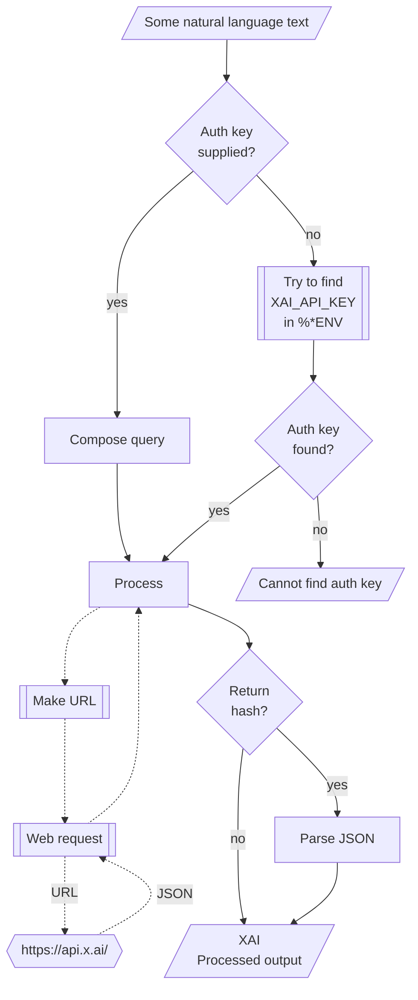

# WWW::XAI

## In brief

This Raku package provides API access to the Large Language Models (LLMs) service [(Space)XAI](https://console.x.ai/), [XAI1].
For more details of the XAI's API usage see [the documentation](https://docs.x.ai/overview), [XAI2].

**Remark:** To use the XAO API one has to register and obtain authorization key.

This package is very similar to the packages 
["WWW::OpenAI"](https://github.com/antononcube/Raku-WWW-OpenAI), [AAp1], and 
["WWW::Gemini"](https://github.com/antononcube/Raku-WWW-Gemini), [AAp2]. 

"WWW::XAI" can be used with (is integrated with) 
["LLM::Functions"](https://github.com/antononcube/Raku-LLM-Functions), [AAp3], and
["Jupyter::Chatbook"](https://github.com/antononcube/Raku-Jupyter-Chatbook), [AAp5].

Also, of course, prompts from 
["LLM::Prompts"](https://github.com/antononcube/Raku-LLM-Prompts), [AAp4],
can be used with XAI's functions.

-----

## Installation

Package installations from both sources use [zef installer](https://github.com/ugexe/zef)
(which should be bundled with the "standard" Rakudo installation file.)

To install the package from [Zef ecosystem](https://raku.land/) use the shell command:

```
zef install WWW::XAI
```

To install the package from the GitHub repository use the shell command:

```
zef install https://github.com/antononcube/Raku-WWW-XAI.git
```

----

## Usage examples

**Remark:** When the authorization key, `auth-key`, is specified to be `Whatever`
then the functions `xai-*` attempt to use the env variable `XAI_API_KEY`.

### Universal "front-end"

The package has an universal "front-end" function `xai-console` for the 
[different functionalities provided by XAI](https://docs.x.ai/overview).

Here is a simple call for a "chat completion":

```raku
use WWW::XAI;
my $ans = xai-console('Where is Roger Rabbit?');
to-json(from-json($ans), :pretty)
```
```
# {
#   "reasoning": {
#     "effort": "low",
#     "summary": "detailed"
#   },
#   "temperature": 0.7,
#   "error": null,
# ...
#   "user": null,
#   "object": "response",
#   "output": [
#     {
#       "id": "rs_2babab5b-0cf3-9717-b51e-f8bfd6334300",
#       "summary": [
#         {
#           "text": "The query is: \"Where is Roger Rabbit?\"\n",
#           "type": "summary_text"
#         }
#       ],
#       "type": "reasoning",
#       "status": "completed"
#     },
#     {
#       "id": "msg_2babab5b-0cf3-9717-b51e-f8bfd6334300",
#       "status": "completed",
#       "content": [
#         {
#           "type": "output_text",
#           "annotations": [
#           ],
#           "text": "**Toontown.**\n\nHe's probably hiding out there with Jessica, dodging weasels and trying not to get dipped.",
#           "logprobs": [
#           ]
#         }
#       ],
#       "role": "assistant",
#       "type": "message"
#     }
#   ],
#   "model": "grok-4.3",
#   "store": true,
#   "background": false,
# ...
# }
```

Another one using Bulgarian:

```raku
xai-console('Колко групи могат да се намерят в този облак от точки.', max-tokens => 1024, format => 'values');
```
```
# Моля, прикачете изображението или данните за точките – без тях не мога да определя броя на групите.
```

### Models

The current XlAI models can be found with the function `xai-models`:

```raku
.say for |xai-models;
```
```
# grok-4.20-0309-non-reasoning
# grok-4.20-0309-reasoning
# grok-4.20-multi-agent-0309
# grok-4.3
# grok-4.5
# grok-build-0.1
# grok-imagine-image
# grok-imagine-image-quality
# grok-imagine-video
# grok-imagine-video-1.5
```

### Code generation

There are two types of completions : text and chat. Let us illustrate the differences
of their usage by Raku code generation. Here is a text completion:

```raku, result=asis
xai-console(
        'generate Raku code for making a loop over a list',
        path => 'code',
        max-tokens => 1024,
        format => 'values');
```
```
# Here's how to loop over a list in Raku:
# 
# ### Basic `for` loop (most common)
# 
# ```raku
# my @colors = <red green blue>;
# 
# for @colors -> $color {
#     say $color;
# }
# ```
# 
# ### Using the topic variable `$_`
# 
# ```raku
# for @colors {
#     say $_;
# }
# ```
# 
# ### With index (using `.kv`)
# 
# ```raku
# for @colors.kv -> $index, $color {
#     say "$index: $color";
# }
# ```
# 
# ### One-liner style
# 
# ```raku
# .say for @colors;
# ```
# 
# ### Using `.map`
# 
# ```raku
# @colors.map({ say $_ });
# ```
# 
# ### With a range of indices
# 
# ```raku
# for ^@colors.elems -> $i {
#     say @colors[$i];
# }
# ```
# 
# **Recommendation**: Use the `for` loop — it's the most idiomatic and readable way in Raku.
```

### Images

Images can be generated with the sub `xai-console` with the path argument being set to "image".
For example, here an image is generated and a URL to is returned:

```raku, eval=FALSE
my $res = xai-console('Generate an image of a raccoon chasing a butterfly.', path => 'image', format => 'values');
```

Here is an example in which a Base64 string is returned and then rendered as an image:

```raku, eval=FALSE
use Image::Markup::Utilities;
my $img = xai-console(
    'Sketches of butterfly themed playing cards (for bridge, etc.)', 
    path => 'image', 
    response-format => 'b64_json',
    format => 'values');
image-from-base64($img);
```

### Chat completions with engineered prompts

Here is a prompt for "emojification" (see the
[Wolfram Prompt Repository](https://resources.wolframcloud.com/PromptRepository/)
entry
["Emojify"](https://resources.wolframcloud.com/PromptRepository/resources/Emojify/)):

```raku
my $preEmojify = q:to/END/;
Rewrite the following text and convert some of it into emojis.
The emojis are all related to whatever is in the text.
Keep a lot of the text, but convert key words into emojis.
Do not modify the text except to add emoji.
Respond only with the modified text, do not include any summary or explanation.
Do not respond with only emoji, most of the text should remain as normal words.
END
```
```
# Rewrite the following text and convert some of it into emojis.
# The emojis are all related to whatever is in the text.
# Keep a lot of the text, but convert key words into emojis.
# Do not modify the text except to add emoji.
# Respond only with the modified text, do not include any summary or explanation.
# Do not respond with only emoji, most of the text should remain as normal words.
```

Here is an example of chat completion with emojification:

```raku
xai-console([ system => $preEmojify, user => 'Python sucks, Raku rocks, and Perl is annoying'], max-tokens => 1024, format => 'values')
```
```
# 🐍 sucks, Raku 🪨, and 🐪 is 😠
```

-------

## Command Line Interface

### Console access

The package provides a Command Line Interface (CLI) script:

```shell
xai-console --help
```
```
# Usage:
#   xai-console.raku <text> [--path=<Str>] [--mt|--max-tokens[=UInt]] [-m|--model=<Str>] [-r|--role=<Str>] [-t|--temperature[=Real]] [-a|--auth-key=<Str>] [--timeout[=UInt]] [-f|--format=<Str>] [--method=<Str>] -- API access to XAI LLMs.
#   xai-console.raku [<words> ...] [--path=<Str>] [--mt|--max-tokens[=UInt]] [-m|--model=<Str>] [-r|--role=<Str>] [-t|--temperature[=Real]] [-a|--auth-key=<Str>] [--timeout[=UInt]] [-f|--format=<Str>] [--method=<Str>]
#   
#     <text>                      Text to be processed or audio file name.
#     --path=<Str>                Path, one of 'chat', 'code', 'image', 'video', or 'voice'. [default: 'chat']
#     --mt|--max-tokens[=UInt]    The maximum number of tokens to generate in the completion. [default: 2048]
#     -m|--model=<Str>            Model. [default: 'Whatever']
#     -r|--role=<Str>             Role. [default: 'user']
#     -t|--temperature[=Real]     Temperature. [default: 0.7]
#     -a|--auth-key=<Str>         Authorization key (to use XAI API.) [default: 'Whatever']
#     --timeout[=UInt]            Timeout. [default: 10]
#     -f|--format=<Str>           Format of the result; one of "json", "hash", "values", or "Whatever". [default: 'Whatever']
#     --method=<Str>              Method for the HTTP POST query; one of "tiny" or "curl". [default: 'tiny']
```

**Remark:** When the authorization key argument "auth-key" is specified set to "Whatever"
then `xai-console` attempts to use the env variable `XAI_API_KEY`.


--------

## Mermaid diagram

The following flowchart corresponds to the steps in the package function `xai-console`:



--------

## References

### Dashboard & documentation

[XAI1] XI, [XAI console](https://console.x.ai).

[XAI2] XAI Platform documentation, [XAI documentation](https://docs.x.ai/overview).

### Packages

[AAp1] Anton Antonov,
[WWW::OpenAI Raku package](https://github.com/antononcube/Raku-WWW-OpenAI),
(2023-2026),
[GitHub/antononcube](https://github.com/antononcube).

[AAp2] Anton Antonov,
[WWW::Gemini Raku package](https://github.com/antononcube/Raku-WWW-Gemini),
(2023-2026),
[GitHub/antononcube](https://github.com/antononcube).

[AAp3] Anton Antonov,
[LLM::Functions Raku package](https://github.com/antononcube/Raku-LLM-Functions),
(2023-2026),
[GitHub/antononcube](https://github.com/antononcube).

[AAp4] Anton Antonov,
[LLM::Prompts Raku package](https://github.com/antononcube/Raku-LLM-Prompts),
(2023-2026),
[GitHub/antononcube](https://github.com/antononcube).

[AAp5] Anton Antonov,
[Jupyter::Chatbook Raku package](https://github.com/antononcube/Raku-Jupyter-Chatbook),
(2023-2026),
[GitHub/antononcube](https://github.com/antononcube).

